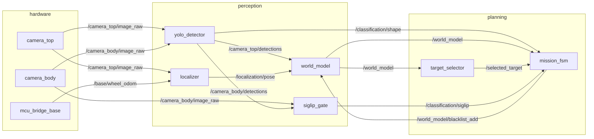
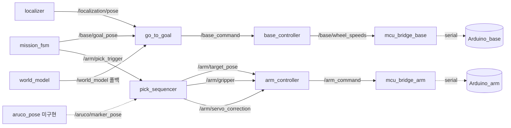
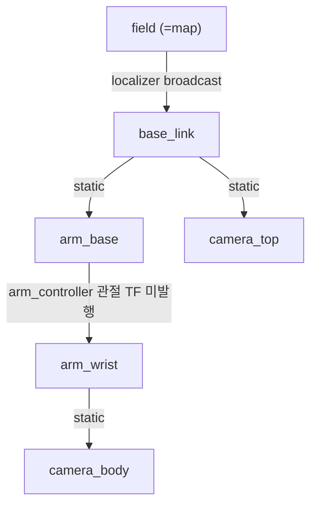
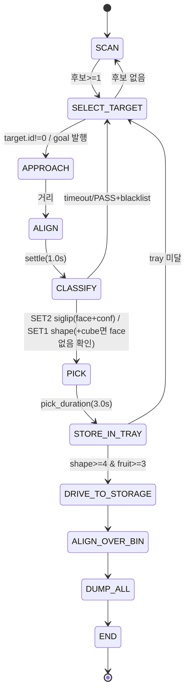

# ROS2 노드 배선 구상도 (AI 로봇 챌린지)

> 실제 `ros2_ws/src` 코드 기준. 모든 토픽/타입은 코드에서 추출·검증한 값.
> 최종 갱신: 2026-06-24 (go_to_goal / pick_sequencer / yolo_detector 신규 + shape_heuristic·yolo_world 폐기 반영).
> 상위 전략·근거는 [architecture.md](architecture.md), 인터페이스 계약은 [ros2_interface_contract.md](ros2_interface_contract.md) 참고.

ROS2 Humble · 단일 Jetson Orin Nano. 6개 ament 패키지:
`robot_interfaces`(msg) · `robot_hardware`(드라이버) · `robot_perception`(인식/추정) ·
`robot_planning`(판단) · `robot_control`(제어) · `robot_bringup`(launch/config).

---

## 1. 레이어 & 노드

### A. HARDWARE (`robot_hardware`)
| 노드 | 역할 | 핵심 pub/sub |
|---|---|---|
| `camera_csi_node` ×2 | IMX219 CSI. `camera_top`(광각, sensor-id=1) / `camera_body`(본체, sensor-id=0) | pub `/camera_{top,body}/image_raw` (sensor_msgs/Image) |
| `mcu_bridge_arm_node` | Arduino_arm 텍스트 시리얼 `<ARM,…>` (+ACK drain) | sub `/arm_command` (ArmCommand) |
| `mcu_bridge_base_node` | Arduino_base 시리얼 `<BASE,…>`/`<ODOM,…>` | sub `/base/wheel_speeds`; pub `/base/wheel_odom` (Float32MultiArray) |

### B. PERCEPTION (`robot_perception`)
| 노드 | 역할 | 핵심 pub/sub |
|---|---|---|
| `yolo_detector_node` ✅NEW | 커스텀 YOLOv8n `models/cube.pt` (4도형 검출+분류), 듀얼스트림 | sub `/camera_{top,body}/image_raw`; pub `/camera_{top,body}/detections` (DetectionArray) + `/classification/shape` (Classification, source='yolo') |
| `siglip_gate_node` | SET2 과일 제로샷 + image-face 판별 | sub `/camera_body/image_raw`, `/camera_body/detections`; pub `/classification/siglip` (Classification) |
| `localizer_node` | 평면 VO + 휠오도 융합, field 포즈 | sub `/base/wheel_odom`, `/camera_top/image_raw`; pub `/localization/pose` (PoseStamped); TF `field→base_link` |
| `world_model_node` | 2D 시맨틱 월드모델(픽셀→지면 투영, NN 트래커) | sub `/camera_top/detections`, `/localization/pose`, `/world_model/blacklist_add`; pub `/world_model` (WorldModel) |

폐기(디스크엔 남김, 미등록): `yolo_world_node`, `shape_heuristic_node` → `yolo_detector_node`로 대체.

### C. PLANNING (`robot_planning`)
| 노드 | 역할 | 핵심 pub/sub |
|---|---|---|
| `target_selector_node` | 7타겟 점수화/라우팅 | sub `/world_model`; pub `/selected_target` (Object) |
| `mission_fsm_node` | 11-state 미션 FSM (픽 게이트, 룰북 §6/§7) | sub `/world_model`,`/selected_target`,`/classification/{siglip,shape}`,`/state_advance`; pub `/mission_state`,`/base/goal_pose`,`/arm/pick_trigger`,`/world_model/blacklist_add` |

### D. CONTROL (`robot_control`)
| 노드 | 역할 | 핵심 pub/sub |
|---|---|---|
| `go_to_goal_node` ✅NEW | 홀로노믹 P제어: field 목표→base 속도 | sub `/base/goal_pose`,`/localization/pose`,`/world_model`(폴백); pub `/base_command` (BaseCommand) |
| `base_controller_node` | 메카넘 IK + watchdog | sub `/base_command`; pub `/base/wheel_speeds` |
| `pick_sequencer_node` ✅NEW | `pick_trigger`(Bool)→look·descend·grasp·lift·tray·drop·return 시퀀스 | sub `/arm/pick_trigger`,`/aruco/marker_pose`(opt); pub `/arm/target_pose`,`/arm/gripper`,`/arm/servo_correction` |
| `arm_controller_node` | 분석 IK(arm_ik)→서보각. 그리퍼 동적 토픽 추가 | sub `/arm/target_pose`,`/arm/servo_correction`,`/arm/gripper`✅NEW; pub `/arm_command` (ArmCommand) |

### 아직 없는 노드 (다음 작업)
- `aruco_pose_node` — body cam ArUco 6DOF 포즈 → `/aruco/marker_pose`. pick_sequencer가 `use_aruco=true`일 때 소비(현재 off; camera→arm_base TF 보정 전).

---

## 2. 데이터·인식 흐름



## 3. 명령·제어 흐름



## 4. TF 트리


- `field→base_link`: localizer 동적. (표준 `map→odom→base_link` 분리는 미적용 — 단순화)
- static 3개(`base→arm_base`, `base→camera_top`, `wrist→camera_body`): **placeholder 값, 실측 교체 필요.**
- arm 관절 동적 TF 미발행 → eye-in-hand `camera_body`가 wrist를 안 따라감(보정 필요).

## 5. 미션 FSM



## 6. 토픽/인터페이스 표

| 토픽 | 타입 | Pub | Sub | 권장 |
|---|---|---|---|---|
| `/camera_*/image_raw` | sensor_msgs/Image | camera_csi | yolo_detector, siglip, localizer | 30Hz, SENSOR_DATA(BEST_EFFORT) |
| `/camera_*/detections` | robot_interfaces/DetectionArray | yolo_detector | world_model, siglip | top~8 / body~16Hz |
| `/classification/shape` | robot_interfaces/Classification | yolo_detector | mission_fsm | on-detection |
| `/classification/siglip` | robot_interfaces/Classification | siglip_gate | mission_fsm | on-detection |
| `/base/wheel_odom` | std_msgs/Float32MultiArray | mcu_bridge_base | localizer | serial |
| `/localization/pose` | geometry_msgs/PoseStamped | localizer | world_model, go_to_goal | 20Hz |
| `/world_model` | robot_interfaces/WorldModel | world_model | target_selector, mission_fsm, go_to_goal | 10Hz |
| `/selected_target` | robot_interfaces/Object | target_selector | mission_fsm | 2Hz |
| `/mission_state` | robot_interfaces/MissionState | mission_fsm | debug/RViz | 5Hz |
| `/base/goal_pose` | geometry_msgs/PoseStamped | mission_fsm | go_to_goal | event/5Hz |
| `/base_command` | robot_interfaces/BaseCommand | go_to_goal | base_controller | 20Hz |
| `/base/wheel_speeds` | std_msgs/Float32MultiArray | base_controller | mcu_bridge_base | 50Hz |
| `/arm/pick_trigger` | std_msgs/Bool | mission_fsm | pick_sequencer | event |
| `/arm/target_pose` | geometry_msgs/Pose | pick_sequencer | arm_controller | 20Hz |
| `/arm/gripper` | std_msgs/Float32 | pick_sequencer | arm_controller | event |
| `/arm/servo_correction` | geometry_msgs/Vector3 | pick_sequencer/(aruco) | arm_controller | 20Hz |
| `/arm_command` | robot_interfaces/ArmCommand | arm_controller | mcu_bridge_arm | 20Hz |
| `/aruco/marker_pose` | geometry_msgs/PoseStamped | aruco_pose(미구현) | pick_sequencer | ~15Hz |

`robot_interfaces` msg 8종: ArmCommand · BaseCommand · Detection · DetectionArray · Classification · Object · WorldModel · MissionState. ArUco는 표준 geometry_msgs 재사용(신규 msg 불필요).

---

## 7. 남은 작업 (Gap)

**해소됨 ✅**: go_to_goal(베이스 구동), pick_sequencer(픽 시퀀스), 동적 그리퍼, yolo_detector(cube.pt), shape_heuristic 폐기.

**남음:**
1. **카메라 캘리브레이션** — world_model intrinsics는 perception.yaml에 입력됨. body cam intrinsics(ArUco/visual servo용) + extrinsics 실측 필요.
2. **static TF 실측** — `base→arm_base`, `base→camera_top`, `wrist→camera_body` placeholder 교체.
3. **`aruco_pose_node`** — look-then-grab 정밀 픽업. 만들고 pick_sequencer `use_aruco=true` + camera→arm_base TF 보정.
4. **localizer 벽 기반 x/y 보정** — 현재 yaw만 스냅(폴백 위계 "벽" 절반).
5. **arm 관절 동적 TF 발행**.
6. **타이밍**: pick_sequencer 기본 시퀀스 3.6s > FSM `pick_duration_sec` 3.0s. **둘 중 하나 맞출 것** (FSM 파라미터 ≥3.6s로 올리거나 dwell 단축).
7. ✅ **수정됨(2026-06-24)**: `cameras.launch.py` sensor_id를 top/wide=1, body=0으로 정정(인벤토리 일치). ⚠️ 단 `perception.yaml`의 `top_fx/fy/cx/cy`는 광각 캘리브 값이어야 함 — 캘리브를 sensor-id 0(본체)에서 떴다면 라벨 불일치이니 재확인.
8. body cam 소프트 화이트밸런스(마젠타 캐스트) 미적용 → SigLIP 입력 품질.

---

## 8. 빌드·실행

```bash
cd ros2_ws
source /opt/ros/humble/setup.bash
# 주의: setuptools 81 + --symlink-install 비호환(develop --uninstall 제거됨) -> 일반 빌드 사용.
# 이전 symlink 잔재가 있으면: rm -rf build/<pkg> install/<pkg> 후 재빌드.
colcon build
source install/setup.bash

ros2 launch robot_bringup bringup.launch.py                       # 전체
ros2 launch robot_bringup bringup.launch.py with_control:=false   # 인식만(제어/MCU 제외)
```
모든 노드 dry-run-safe: 모델/카메라/MCU 없어도 기동(유휴). 경기 당일 `set1_label`/`set2_label`을 perception.yaml에 입력.

## 9. 단일 Jetson 권장
- camera_csi + yolo_detector를 **ComponentContainer**로 묶어 이미지 zero-copy.
- image QoS = **SENSOR_DATA(BEST_EFFORT, depth≤5)**.
- YOLOv8n predict는 공유모델+Lock, SigLIP은 on-detection(연속추론 금지). OOM 시 SigLIP fp16/lazy.
- 무거운 모델 노드는 LifecycleNode(`configure`서 가중치 로드)로 워밍업/복구 제어 권장.
